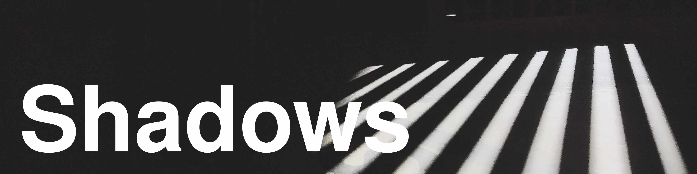

# Shadows

Shadows are on-disk interfaces for scverse data standards such as [AnnData](https://github.com/scverse/anndata) and [MuData](https://github.com/scverse/mudata).

It is an experimental project.

[](https://pypi.org/project/shadows)

## Installation

```
pip install shadows
# or
pip install git+https://github.com/scverse/shadows
```

## Features

The shadows library aims to implement the following features:

- [x] **Shadow objects**: Read-only AnnDataShadow and MuDataShadow for HDF5 files.

- [x] AnnDataShadow and MuDataShadow for Zarr files.

- [x] AnnDataShadow and MuDataShadow for Parquet-based serialization ([pqdata](https://github.com/gtca/pqdata)).

- [ ] Data shadows for `.pqdata` files on S3 storage.


### Shadow objects

Briefly, shadow objects simply work like this:

```py
from shadows import *
ash = AnnDataShadow("pbmc3k.h5ad")
msh = MuDataShadow("pbmc5k_citeseq.h5mu")
```

All the various features are showcased in the following tutorials:

- [Getting started with shadow objects](/docs/examples/shadow-objects.ipynb)

- [Advanced features of shadow objects](/docs/examples/shadows-features.ipynb)

